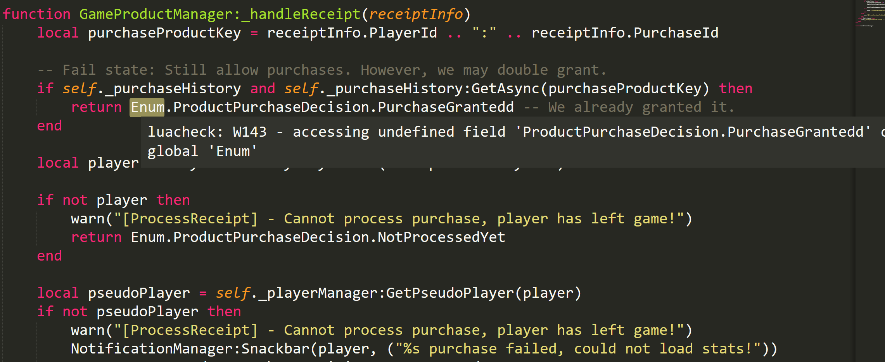
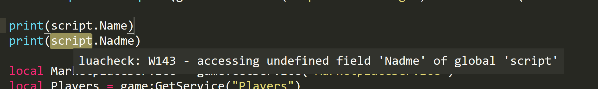

## Roblox Luacheck

	

Generates the `roblox_standard.lua` file necessary to provide support for Roblox Lua in Luacheck.

## What is Luacheck
If you're using Roblox outside of Roblox Studio, [Luacheck](https://github.com/mpeterv/luacheck) is a linter that will analyze your code for you.

## Examples
Here are some examples of the .luacheck in action. Traditional .luacheckrc files will not catch these errors.

## Features

* Automatically applies `script` and `workspace` properties
* Automatically applies the `Enum` namespace
* Has definitions for Roblox types and variables
* Specifically ignores adding `Workspace` and other global variables following Roblox's standards
* Does not show deprecated properties

## Run and updating
To run you need Lua (5.1 or higher). Running the script will pull the latest version of the Roblox API and then pull in the latest Enums and game/workspace properties.

## Usage
You can copy the contents of `roblox_standard.lua` into your `.luacheckrc`

Inspired by [luacheck-love](https://github.com/Positive07/luacheck-love).